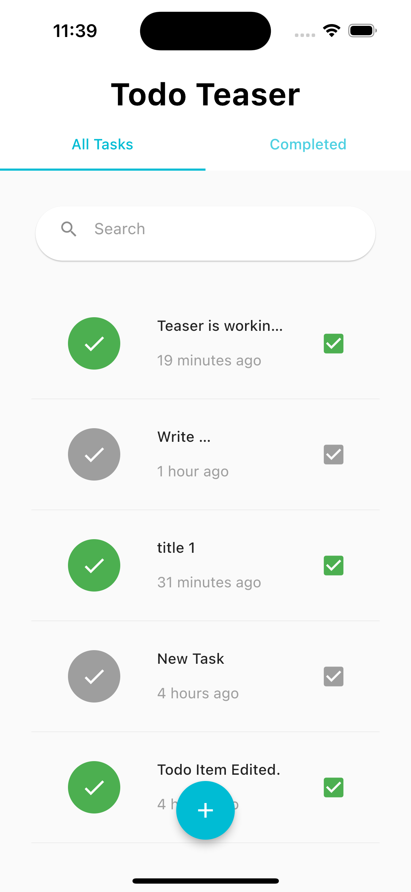

# Todo App

The Todo App is a cross-platform task management application built with Flutter. It allows users to create, view, update, and delete Todo items, providing an efficient way to manage their tasks.

## Features

The Todo App offers the following features:

- Add new Todo items with a title and description.
- View the list of existing Todo items.
- Update the details of a specific Todo item.
- Change the status of a Todo item (completed/incomplete).
- Delete a Todo item from the list.

## Screenshots

View a list of all available tasks

 

Click to view Description , When was a task created and when it was updated 

 

View a list of completed tasks

 

Edit Task Title and Task description 

 

You can search for a task 
(Example here a search title was new and this is the result)

 

FULL DEMO IS HERE 

<video width="320" height="240" controls>
  <source src="screenshots/teaser.mov" type="video/mov">
  Your browser does not support the video tag.
</video>

## Technology Used

The Todo App is implemented using Flutter, a popular framework for building multi-platform applications. Flutter offers a rich set of tools and widgets for creating beautiful, responsive user interfaces. The app leverages Flutter's hot-reload feature for fast development and testing.

### State Management

The app uses the Provider package for state management. Provider provides an easy and efficient way to manage application state, allowing seamless updates to the UI when data changes. It follows the "single source of truth" principle and enables efficient communication between different parts of the app.

### Cross-Platform Compatibility

The Todo App is designed to run on multiple platforms, including:

- Web: Users can access and manage their Todo list through a web browser.
- Mobile (iOS and Android): The app is optimized for mobile devices, providing a smooth and intuitive user experience.
- Desktop: The app is also available as a desktop application, allowing users to manage their tasks from their desktop computers.

## Getting Started

To run the Todo App on your local machine, follow these steps:

1. Ensure you have Flutter installed. Refer to the official Flutter documentation for installation instructions: [Flutter Installation Guide](https://flutter.dev/docs/get-started/install)

2. Clone this repository to your local machine:

3. Navigate to the project directory:

4. Install the required dependencies:

5. Run the app:

